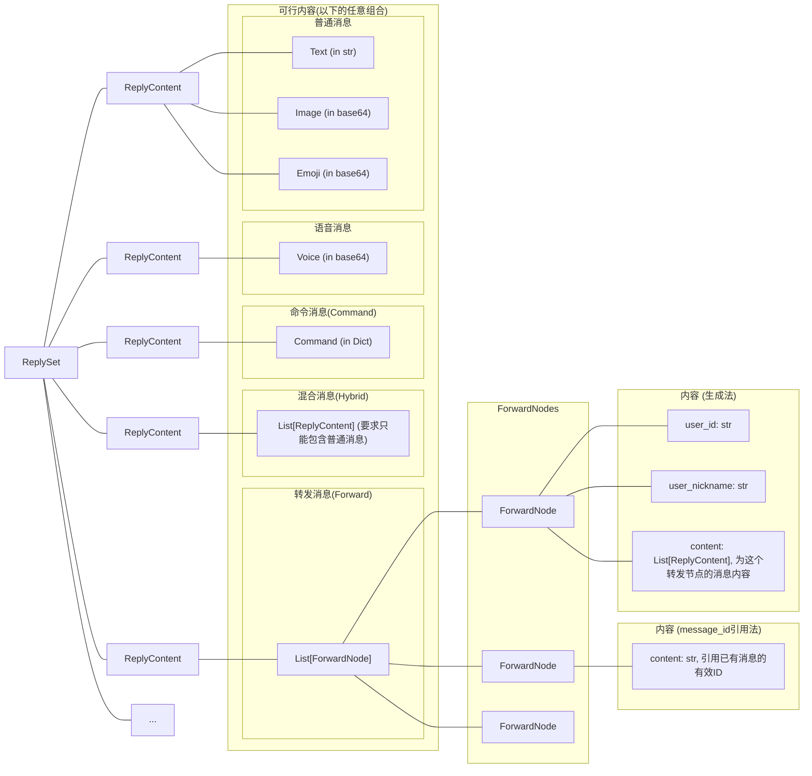

# 有关转发消息和其他消息的构建类型说明

```mermaid
graph LR;
    direction TB;
    A[ReplySet] --- B[ReplyContent];
    A --- C["ReplyContent"];
    A --- K["ReplyContent"];
    A --- L["ReplyContent"];
    A --- N["ReplyContent"];
    A --- D[...];
    B --- E["Text (in str)"];
    B --- F["Image (in base64)"];
    C --- G["Voice (in base64)"];
    B --- I["Emoji (in base64)"];
    subgraph "可行内容(以下的任意组合)";
        subgraph "转发消息(Forward)"
            M["List[ForwardNode]"]
        end
        subgraph "混合消息(Hybrid)"
            J["List[ReplyContent] (要求只能包含普通消息)"]
        end
        subgraph "命令消息(Command)"
            H["Command (in Dict)"]
        end
        subgraph "语音消息"
            G
        end
        subgraph "普通消息"
            E
            F
            I
        end
    end
    N --- H
    K --- J
    L --- M
    subgraph ForwardNodes
        O["ForwardNode"]
        P["ForwardNode"]
        Q["ForwardNode"]
    end
    M --- O
    M --- P
    M --- Q
    subgraph "内容 (message_id引用法)"
        P --- U["content: str, 引用已有消息的有效ID"];
    end
    subgraph "内容 (生成法)"
        O --- R["user_id: str"];
        O --- S["user_nickname: str"];
        O --- T["content: List[ReplyContent], 为这个转发节点的消息内容"];
    end
```

另外，自定义消息类型我们在这里不做讨论。

以上列出了所有可能的ReplySet构建方式，下面我们来解释一下各个类型的含义。